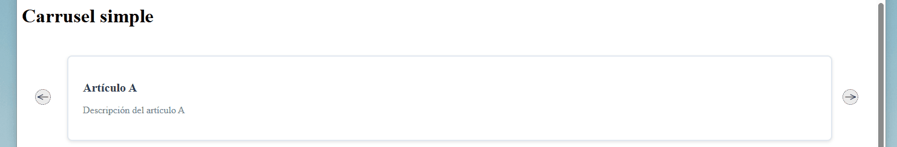

# custom-carousel V1.0.1 <p align="center"><a href="https://laravel.com" target="_blank"></a></p>

<p align="center">
<a href="https://github.com/laravel/framework/actions"></a>
<a href="https://packagist.org/packages/laravel/framework"></a>
<a href="https://packagist.org/packages/laravel/framework"></a>
<a href="https://packagist.org/packages/laravel/framework"></a>
</p>

## About Laravel

Laravel is a web application framework with expressive, elegant syntax. We believe development must be an enjoyable and creative experience to be truly fulfilling. Laravel takes the pain out of development by easing common tasks used in many web projects, such as:

- [Simple, fast routing engine](https://laravel.com/docs/routing).
- [Powerful dependency injection container](https://laravel.com/docs/container).
- Multiple back-ends for [session](https://laravel.com/docs/session) and [cache](https://laravel.com/docs/cache) storage.
- Expressive, intuitive [database ORM](https://laravel.com/docs/eloquent).
- Database agnostic [schema migrations](https://laravel.com/docs/migrations).
- [Robust background job processing](https://laravel.com/docs/queues).
- [Real-time event broadcasting](https://laravel.com/docs/broadcasting).

Laravel is accessible, powerful, and provides tools required for large, robust applications.

## Learning Laravel

Laravel has the most extensive and thorough [documentation](https://laravel.com/docs) and video tutorial library of all modern web application frameworks, making it a breeze to get started with the framework.

You may also try the [Laravel Bootcamp](https://bootcamp.laravel.com), where you will be guided through building a modern Laravel application from scratch.

If you don't feel like reading, [Laracasts](https://laracasts.com) can help. Laracasts contains over 2000 video tutorials on a range of topics including Laravel, modern PHP, unit testing, and JavaScript. Boost your skills by digging into our comprehensive video library.

## Laravel Sponsors

We would like to extend our thanks to the following sponsors for funding Laravel development. If you are interested in becoming a sponsor, please visit the Laravel [Patreon page](https://patreon.com/taylorotwell).

### Premium Partners

- **[Vehikl](https://vehikl.com/)**
- **[Tighten Co.](https://tighten.co)**
- **[Kirschbaum Development Group](https://kirschbaumdevelopment.com)**
- **[64 Robots](https://64robots.com)**
- **[Cubet Techno Labs](https://cubettech.com)**
- **[Cyber-Duck](https://cyber-duck.co.uk)**
- **[Many](https://www.many.co.uk)**
- **[Webdock, Fast VPS Hosting](https://www.webdock.io/en)**
- **[DevSquad](https://devsquad.com)**
- **[Curotec](https://www.curotec.com/services/technologies/laravel/)**
- **[OP.GG](https://op.gg)**
- **[WebReinvent](https://webreinvent.com/?utm_source=laravel&utm_medium=github&utm_campaign=patreon-sponsors)**
- **[Lendio](https://lendio.com)**

## Contributing

Thank you for considering contributing to the Laravel framework! The contribution guide can be found in the [Laravel documentation](https://laravel.com/docs/contributions).

## Code of Conduct

In order to ensure that the Laravel community is welcoming to all, please review and abide by the [Code of Conduct](https://laravel.com/docs/contributions#code-of-conduct).

## Security Vulnerabilities

If you discover a security vulnerability within Laravel, please send an e-mail to Taylor Otwell via [taylor@laravel.com](mailto:taylor@laravel.com). All security vulnerabilities will be promptly addressed.

## License

The Laravel framework is open-sourced software licensed under the [MIT license](https://opensource.org/licenses/MIT).

# CustomCarousel Component

Este repositorio contiene un componente de carrusel (CustomCarousel) que permite dado un bloque html personalizado desplazarse entre elementos dentro de un contenedor realizando un efecto de carrusel

# Características

- Personalización total del contenido mostrado con efecto de carrusel.
- Personalización del número de elementos mostrados dentro del componente.
- Personalización de tamaño de botones de desplazamiento de la vista entre elementos.

## Instalación

1. Clona el repositorio.
2. Si quieres ver el ejemplo del componente puede instalar las dependecias necesarias con 'npm install' y 'composer install'
3. Para usar el componente en su proyecto con Vue debe registrar el componente en su archivo app.js o donde tenga el punto de montaje de Vue

## Parametros

### data_carrousel

- Array con los json/object que se van a usar para el carrusel 
---

### item_slots(opcional)

- Número de elementos mostrados dentro del carrusel (el componente intentará ajustar automaticamente los elementos dentro del componente para que entren dentro de a parte visible para el usuario, por defecto 1)

---

### arraow_width(opcional)

- Tamaño en pixeles que van a tener los botones que se encargan de desplazar los elementos (por defecto 50px)

---

### identitify

- Si se usa el componente dentro de la misma pagina varias veces es obligatorio establecer un identificador para evitar que los componentes interactuen entre ellos de forma erratica


## Configuración

### Carrusel simple (configuración mínima)

- El componente de carrusel requiere de crear un template para dar forma a como se van a ver los datos 
- se recomienda que exista un "div" raiz que tenga un margin para mantener separacion entre elementos

```
    <custom-carousel :data_carrousel="simple_data" :identitify="'simple-carousel'">
        <template #body="{item, index}">
            <div class="card">
                <h2>{{ item.title }}</h2>
                <p>{{ item.description }}</p>
            </div>
        </template>
    </custom-carousel>
```

<p align="center">
   
</p>

### Carrusel con elementos mostrados personalizados

- al usar "item_lots" se define el número de datos mostrados a la vez dentro del componente

```
    <custom-carousel :data_carrousel="complex_data" :item_slots="5" :identitify="'carousel-cusomt-item-slots'">
        <template #body="{item, index}">
            <div class="card-2">
                <div class="card-header">
                    
                    <div class="card-header-content">
                    <h3 class="card-name">{{ item.name }}</h3>
                    <p class="card-title">{{ item.title }}</p>
                    <span class="card-date">{{ item.date }}</span>
                    </div>
                </div>
                <div class="card-body">
                    <p class="card-description">{{ item.description }}</p>
                    <p class="card-location"><strong>Ubicación:</strong> {{ item.location }}</p>
                </div>
                <div class="card-footer">
                    <button class="card-button" @click="handleClick(index)">Ver Más</button>
                </div>
            </div>
        </template>
    </custom-carousel>
```


<p align="center">
   
</p>

### Carrusel con tamaño botones personalizados

- Con "arrow_width" se especifica un tamaño para los botones laterales del compoenente 

```
<custom-carousel :data_carrousel="complex_data2" :item_slots="3" :identitify="'carousel-cusomt-arrows'" arraow_width="160">
    <template #body="{item, index}">
        <div class="card-3">
            <div class="card-header-3">
                
                <div class="card-header-content-3">
                <h3 class="card-name-3">{{ item.name }}</h3>
                <p class="card-title-3">{{ item.title }}</p>
                <span class="card-date-3">{{ item.date }}</span>
                </div>
            </div>
            <div class="card-body-3">
                <p class="card-description-3">{{ item.description }}</p>
                <p class="card-location-3"><strong>Ubicación:</strong> {{ item.location }}</p>
            </div>
            <div class="card-footer-3">
                <button class="card-button-3">Ver Más</button>
            </div>
        </div>
    </template>
</custom-carousel>
```

<p align="center">
   
</p>